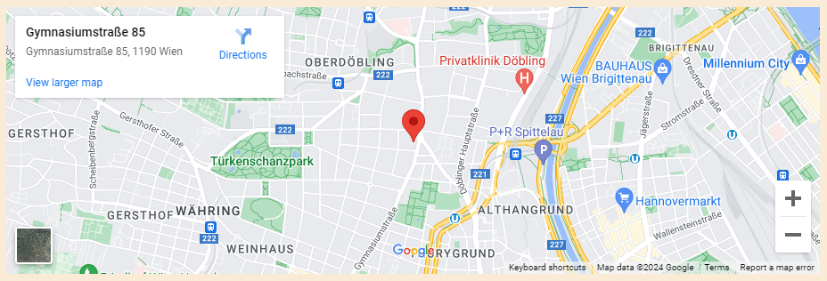

# Magitnup's Dance School

"Home to motivated dancers and a wonderful place to connect with likeminded individuals."

That's the motto of Magitnup's Dance School. They try to show the magical world of dance to young and old, beginners and veterans.

### Features:
+ Navigation Bar:
    + Featured on all 6 pages
    + Fully responsive
    + Including links to: the 'Home', 'Schedule', 'Registration', 'Events & Performances', 'The Team', 'Contact' pages
    + Allows easy navigation from page to page without the use of the 'back' button.
    + Includes the hover function to change color.

+ The landing page image:
    + The image shows an AI generated woman dancing in front of two ginormous hands that try to hold/catch her. It perfectly depicts our struggle against certain standards of society.

+ Home:
    + Other than the landing page image, it also got a smaller menu with pictures, again linked to the 'Schedule', 'Registration', 'Events & Performances' and 'The Team' pages.

+ Register:
    + The 'Registration' tab, allows you to sign up for your first visit.

+ iframe:
    + The 'Contact' uses an iframe from [MAPS.ie](https://www.maps.ie/create-google-map/) which helps you locate the Dance School.

### Goals:
+ The website should be easy to understand and navigate
+ focus on using html and css
+ no visual clutter

### Testing:

+ Banner-Picture:
    + Depending on Laptop/PC or mobile screen: 
    The landing page image, as well as all the other images of that size will not be shown on smaller devices. That way the information won't be covered/overwhelmed by visual clutter.
+ Schedule:
    + Depending on Laptop/PC or mobile screen the data will be displayed differently.

+ To get an appealing look there was a lot of testing with 'margin' and 'padding'
+ Tried adding an audio element, but couldn't make it stick without an error report.
    + Didn't want to leave the bug, so I removed the audio of 'Vienna Blood' a beautyful Viennese Waltz...

### Validator Testing:

+ No errors were returned when passing through the official:
    + index.html [W3C validator](https://validator.w3.org/nu/?showsource=yes&showoutline=yes&showimagereport=yes&doc=https%3A%2F%2Fmagitnup.github.io%2Fmagitnups-dance-school%2Findex)
    + schedule.html [W3C validator](https://validator.w3.org/nu/?showsource=yes&showoutline=yes&showimagereport=yes&doc=https%3A%2F%2Fmagitnup.github.io%2Fmagitnups-dance-school%2Fpages%2Fschedule)
    + registration.html [W3C validator](https://validator.w3.org/nu/?showsource=yes&showoutline=yes&showimagereport=yes&doc=https%3A%2F%2Fmagitnup.github.io%2Fmagitnups-dance-school%2Fpages%2Fregistration)
    + events_performances.html [W3C validator](https://validator.w3.org/nu/?showsource=yes&showoutline=yes&showimagereport=yes&doc=https%3A%2F%2Fmagitnup.github.io%2Fmagitnups-dance-school%2Fpages%2Fevents_performances)
    + the_team.html [W3C validator](https://validator.w3.org/nu/?showsource=yes&showoutline=yes&showimagereport=yes&doc=https%3A%2F%2Fmagitnup.github.io%2Fmagitnups-dance-school%2Fpages%2Fthe_team)
    + contact.html [W3C validator](https://validator.w3.org/nu/?showsource=yes&showoutline=yes&showimagereport=yes&doc=https%3A%2F%2Fmagitnup.github.io%2Fmagitnups-dance-school%2Fpages%2Fcontact)

+ No errors were found when passing through the official:
    + basestyle.css [(Jigsaw) validator](http://jigsaw.w3.org/css-validator/validator?lang=en&profile=css3svg&uri=https%3A%2F%2Fmagitnup.github.io%2Fmagitnups-dance-school%2Findex.html&usermedium=all&vextwarning=&warning=1)

### Deployment:

Because of christmas working hours, had to rush the project in a short time.
#### First Steps:
+ connected 'Github' to 'Visual Studio Code'
+ used 'Visual Studio Code' extensions:
    + 'Live Preview'
    + 'Prettier - Code formatter'
+ Files:
    + audios (ended up not getting used because of bugs)
    + images
    + pages
    + style
    + ...
    

### Credits:

+ my Brother:
    + for explaining how to use: 
    '@media only screen and ....' 
    was still struggling with it thought...
+ Content:
    + Text for 'The Team' inspired by [ChatGPT](https://chat.openai.com/c/3256967e-e17a-4af2-8df9-594314467a2e)
    + Schedule: tabelle in ul umwandeln lassen [ChatGPT](https://chat.openai.com/c/da16c0e4-0a90-44e5-b395-fa5ecc8c4f97)
    + galerie: [Bro Code](https://www.youtube.com/watch?v=uu0lOX6Ot3s)
    + background-image: [Dani Krossing](https://www.youtube.com/watch?v=_w6N_nplmAw) 
+ Media:
    + Images taken from [pixabay](https://pixabay.com)
    + in general for looking up code [W3schools](https://www.w3schools.com)